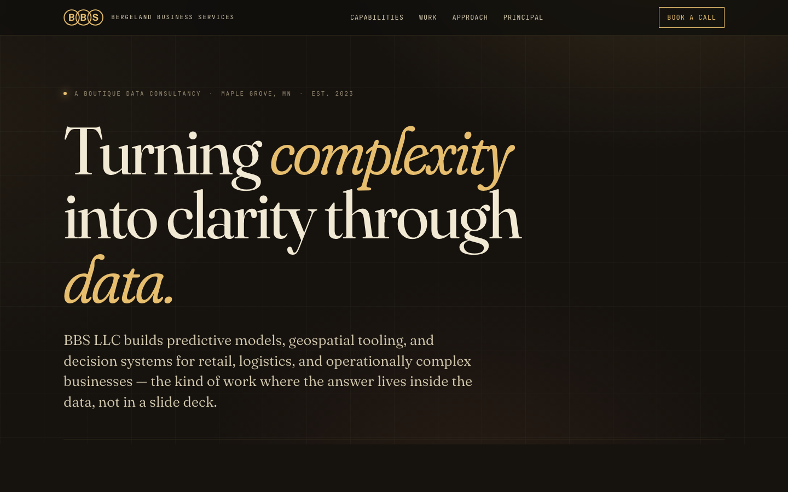
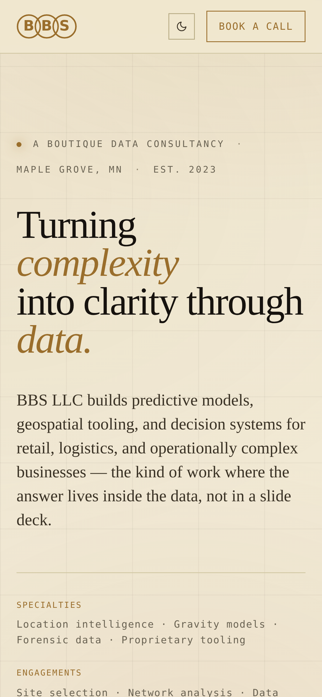
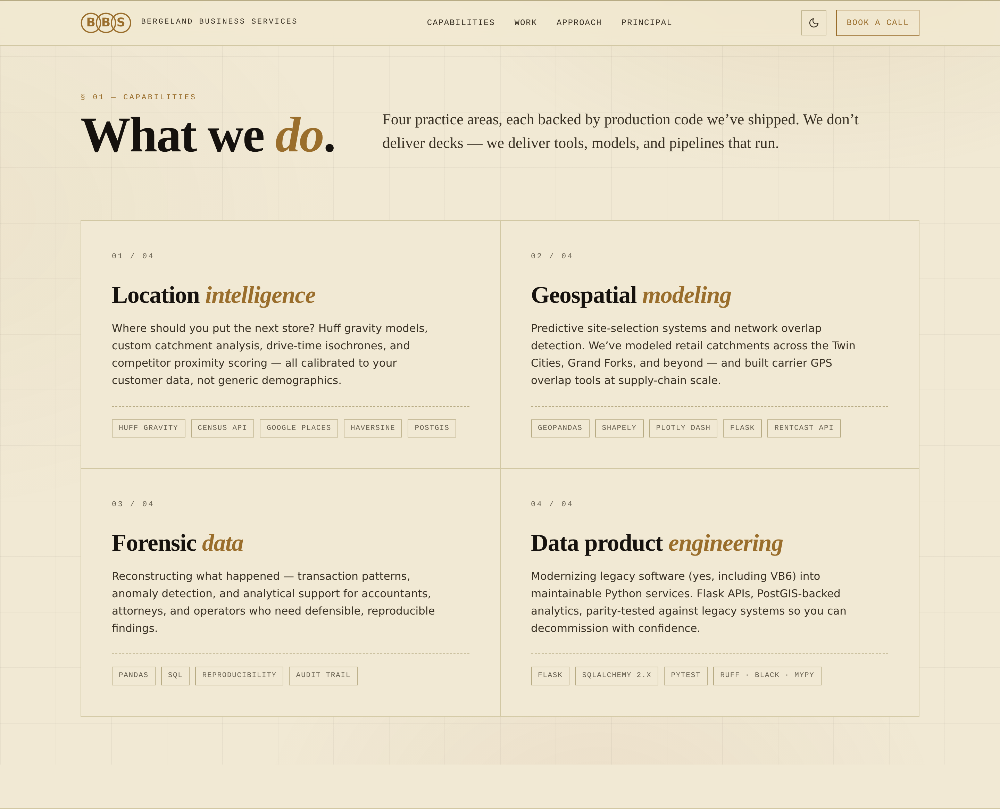
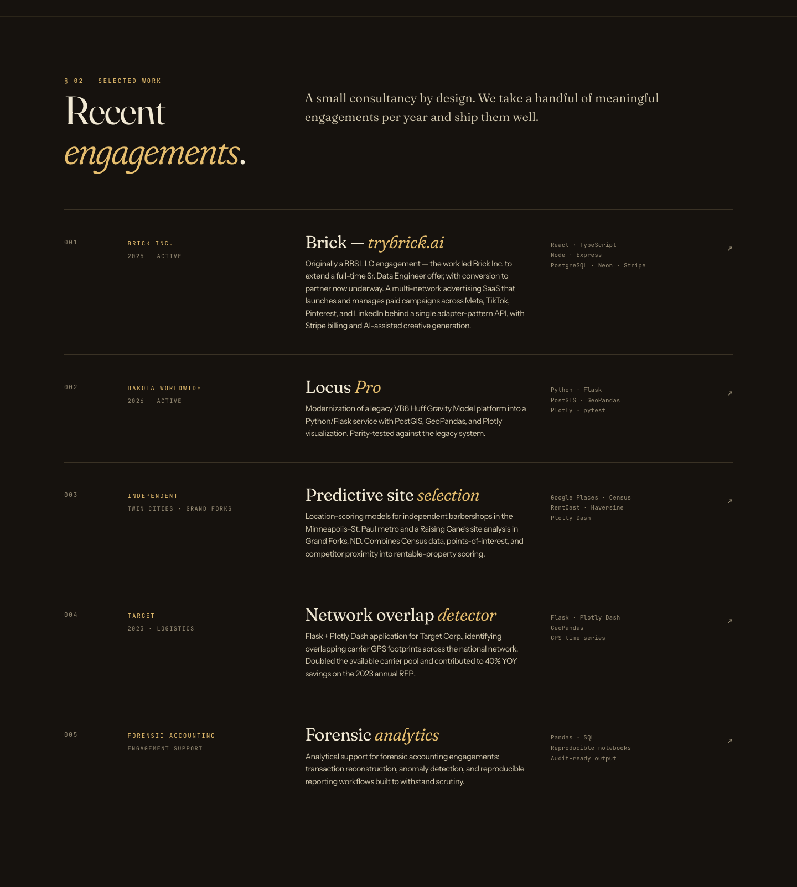
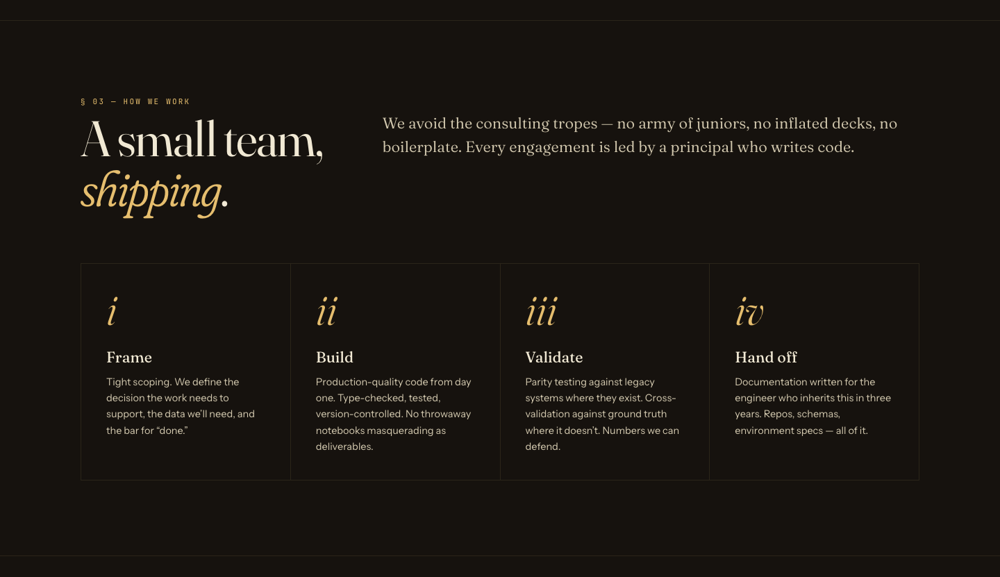
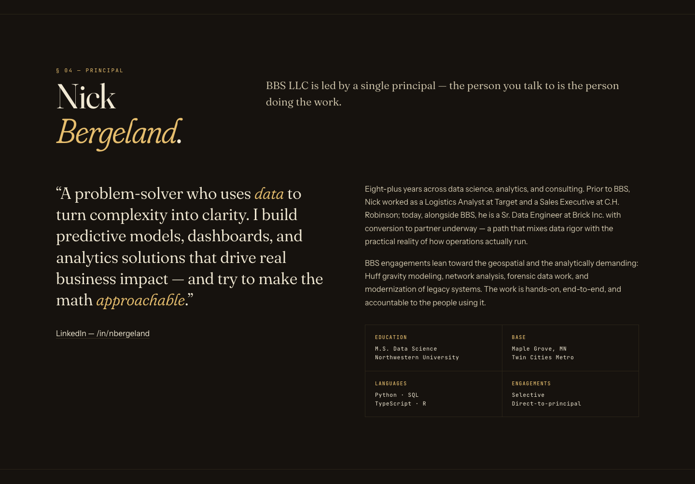
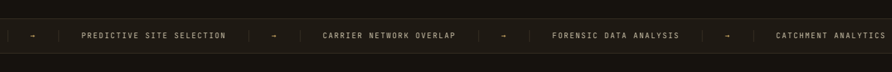
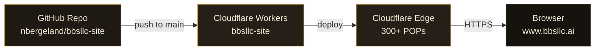

<div align="center">


# bbsllc-site

The marketing site for **BBS LLC, Bergeland Business Services**, a boutique data consultancy specializing in location intelligence, gravity models, geospatial analytics, and forensic data work. Based in Maple Grove, MN.

[](https://www.bbsllc.ai)
[](https://workers.cloudflare.com)
[](#tech-stack)
[](#local-development)

[Live site](https://www.bbsllc.ai) · [Capabilities](https://www.bbsllc.ai/#capabilities) · [Selected work](https://www.bbsllc.ai/#work) · [Approach](https://www.bbsllc.ai/#approach) · [Book a call](https://calendly.com/nnbergeland)

</div>

---

## Overview

A single self-contained `index.html` (no framework, no bundler, no build pipeline) shipped from this repository to **Cloudflare Workers** at the edge. Every push to `main` triggers a Worker deploy via the GitHub integration. The canonical domain is **`www.bbsllc.ai`**, with the apex `bbsllc.ai` 301-redirecting to www, and `bbsolutions.biz` reserved for a future redirect to the same canonical host.

The design is intentionally restrained: an editorial typographic system (Fraunces, Instrument Sans, JetBrains Mono), a warm dark palette (ink, gilt, paper), a faint coordinate-grid background, and a GPU-accelerated marquee ticker. Total payload is one HTML document plus three Google Fonts requests.

---

## Screenshots

### Hero (desktop, 1440 wide)



### Hero (mobile, 390 × 844)

<p align="center">
  
</p>

### Capabilities

The four practice areas, each with a tech-stack pill row.



### Engagement cards (Selected work)



### Approach



### Principal



### Ticker bar (GPU-accelerated marquee)



---

## Architecture



Plain-text view for environments that do not render Mermaid:

```
┌──────────────────────┐  git push   ┌──────────────────────┐  Workers Build  ┌──────────────────────┐
│ Local checkout       │ ──────────▶ │ GitHub               │ ──────────────▶ │ Cloudflare Workers   │
│ index.html, robots   │             │ nbergeland/bbsllc-   │   (on push to   │ static-assets binding│
│                      │             │ site (default: main) │    main)        │ on every commit      │
└──────────────────────┘             └──────────────────────┘                 └──────────┬───────────┘
                                                                                         │
                                                                                         ▼
                                                              ┌────────────────────────────────────┐
                                                              │ Cloudflare DNS + Routes            │
                                                              │   www.bbsllc.ai (canonical)        │
                                                              │   bbsllc.ai → 301 → www            │
                                                              │   bbsolutions.biz → future 301     │
                                                              └─────────────┬──────────────────────┘
                                                                            │
                                                                            ▼
                                                                     end users (HTTPS)
```

A push to `main` triggers a Cloudflare Worker deployment. The Worker serves `index.html` (and `robots.txt`) directly from the edge, so first-byte latency is dominated by the closest Cloudflare POP, not by an origin server.

**Why Workers over Pages.** Workers Static Assets gives the same zero-config static hosting Pages provided, plus the option to graduate to programmatic edge logic (redirect rules, A/B routes, signed responses, geo-aware variants) without leaving the runtime. The Worker entrypoint is configured to serve `index.html` for `/` and let the assets binding handle every other path.

---

## Tech stack

| Layer        | Choice                                                                 |
|--------------|------------------------------------------------------------------------|
| Markup       | Hand-written HTML5, single `index.html`                                |
| Styling      | Vanilla CSS with custom properties (no Tailwind, no preprocessor)      |
| Typography   | Google Fonts: **Fraunces** (variable display serif), **Instrument Sans** (UI sans), **JetBrains Mono** (mono accents) |
| JavaScript   | None. One ~10-line inline `IntersectionObserver` reveal, no framework  |
| Icons        | Inline SVG, `currentColor`-themed                                      |
| Hosting      | Cloudflare Workers (Static Assets), custom domain, automatic HTTPS     |
| DNS / TLS    | Cloudflare proxied (orange-cloud), Universal SSL, HSTS                 |
| Source       | GitHub (`nbergeland/bbsllc-site`), Workers Builds watching `main`      |

Design tokens (palette, type scale, spacing) live in `:root` CSS variables at the top of `index.html`. There is no `package.json`, no `node_modules`, no compile step.

---

## Site sections

The page is one document broken into anchored sections. Each `block` section uses a two-column header (numbered eyebrow + title left, lede right) collapsing to a single column under 880 px.

| §   | Section            | Purpose                                                                                                       |
|-----|--------------------|---------------------------------------------------------------------------------------------------------------|
| 00  | **Hero**           | Display lede ("Turning complexity into clarity through data"), specialties, engagements, stack                |
| —   | **Ticker**         | GPU-accelerated marquee surfacing practice areas in motion                                                    |
| 01  | **Capabilities**   | Four practice cards: Location Intelligence, Geospatial Modeling, Forensic Data, Data Product Engineering      |
| 02  | **Selected Work**  | Engagement table: Brick Inc., Dakota Worldwide (Locus Pro), independent site selection, Target network overlap, forensic accounting |
| 03  | **Approach**       | Four-step working model: Frame, Build, Validate, Hand off                                                     |
| 04  | **Principal**      | Bio (Nick Bergeland), pull quote, credentials grid (Education, Base, Languages, Engagements)                  |
| 05  | **CTA**            | "Let's build the thing that answers your question." Calendly + email                                          |
| —   | **Footer**         | Brand mark, navigation, contact, elsewhere links, copyright                                                    |

---

## Deployment workflow

1. Edit `index.html` locally.
2. Preview at `http://localhost:8080` (see [Local development](#local-development)).
3. Commit and push to `main`.
4. Cloudflare Workers Builds pulls the repo, packages static assets, and rolls out a new Worker version.
5. Active deployment is served from `www.bbsllc.ai` within ~10 seconds of build completion.

### Worker configuration (reference)

The Worker is configured for static-asset hosting only. Equivalent `wrangler.toml`:

```toml
name = "bbsllc-site"
main = "src/worker.js"          # optional; assets binding alone is sufficient
compatibility_date = "2026-01-01"

[assets]
directory = "."                  # serve files from repo root
not_found_handling = "single-page-application"   # fallback to index.html
```

If `src/worker.js` is present, it can intercept requests for redirects or analytics; otherwise, the assets binding answers all routes directly.

### Rolling back

Cloudflare retains prior Worker versions. Any deploy can be promoted from the **Workers** dashboard under **Deployments → Rollback**. No git revert is required to recover from a bad change.

For the operational DNS and redirect runbook (initial provisioning, GoDaddy nameserver swap, MX preservation, post-launch QA checklist), see [`DEPLOY.md`](./DEPLOY.md).

---

## Domain configuration

| Hostname              | Status      | Behavior                                                       |
|-----------------------|-------------|----------------------------------------------------------------|
| `www.bbsllc.ai`       | Canonical   | Serves the Worker. All traffic terminates here.                |
| `bbsllc.ai` (apex)    | Redirect    | 301 to `https://www.bbsllc.ai/${uri}` via Cloudflare rule.     |
| `bbsolutions.biz`     | Reserved    | Future 301 to `https://www.bbsllc.ai/${uri}` (not yet live).   |
| `www.bbsolutions.biz` | Reserved    | Same as above.                                                 |

DNS is hosted at Cloudflare (proxied / orange-cloud) for both zones. CNAME flattening at the apex points `@` and `www` at the Worker route. Universal SSL covers all four hostnames.

The `bbsolutions.biz` redirect is intentional brand consolidation: the legacy domain forwards into the canonical `bbsllc.ai` so historical references continue to resolve while net-new mentions point at the active brand. The redirect will be implemented as a Cloudflare Bulk Redirect (no Worker code change needed).

---

## Local development

The site is a single static file. Any HTTP server works.

```bash
# from the repo root
python3 -m http.server 8080
# then open http://localhost:8080
```

Or with Node:

```bash
npx serve -l 8080 .
```

For local Worker parity (rare, since there is no edge logic yet):

```bash
npx wrangler dev
```

Edits to `index.html` are reflected on browser refresh. There is no watcher, no HMR, and no build cache to invalidate.

---

## Performance notes

The site is small enough that performance work is mostly about *not breaking* what plain HTML already gives you. A few intentional choices:

- **Single-document hosting.** No CSS or JS chunks. The browser parses the document, fetches fonts, paints. First Contentful Paint is bound by font load.
- **Font preconnect.** `<link rel="preconnect">` on both `fonts.googleapis.com` and `fonts.gstatic.com` (with `crossorigin` on the latter) shaves the first font-fetch RTT.
- **GPU-promoted ticker.** The marquee uses `transform: translate3d`, `will-change: transform`, `backface-visibility: hidden`, `perspective: 1000px`, and `contain: content` so the animation runs on the compositor thread and does not invalidate page layout.
- **Pointer-events none on the ticker.** Vertical scroll passes through the marquee on touch devices, which would otherwise hijack scroll on iOS.
- **`prefers-reduced-motion` honored.** Both the ticker animation and smooth scroll are disabled for users who request reduced motion.
- **Mobile scroll behavior.** Smooth scroll is disabled below 768 px because momentum scrolling produces a better feel on touch.
- **Responsive type.** Display sizes use `clamp(min, vw-fluid, max)` so headlines scale linearly between 48 px and 132 px without media-query stair-steps.
- **Reveal animations are one-shot.** The IntersectionObserver unobserves each element after triggering, so the animation runs once and never re-fires.
- **Inline SVG logo.** The header and footer logos are inline SVGs with `currentColor` strokes/fills, so theme-color changes propagate without re-fetching an asset.

### Responsive breakpoints

| Breakpoint | Triggers                                                                                                |
|------------|---------------------------------------------------------------------------------------------------------|
| `980 px`   | Approach grid collapses 4-up to 2-up                                                                    |
| `880 px`   | Section heads collapse to single column, work rows stack, principal grid stacks, footer reflows to 2-up |
| `780 px`   | Capabilities grid stacks to single column, top-nav links hide                                           |
| `768 px`   | Smooth scroll disabled, ticker speed bumped to 5s loop                                                  |
| `560 px`   | Hero meta stacks vertically, approach grid drops to 1 column                                            |
| `540 px`   | Brand wordmark hides next to the logo                                                                   |
| `480 px`   | Buttons shrink, CTA row goes vertical, footer goes single column, nav CTA shrinks                       |
| `420 px`   | Credentials grid collapses to a single column                                                            |

---

## Browser support

Modern evergreen browsers. The site uses CSS custom properties, `clamp()`, `backdrop-filter`, `contain`, and `IntersectionObserver`, all of which are supported across Chrome, Edge, Safari 14+, and Firefox. Graceful degradation: if `backdrop-filter` is unavailable, the nav still renders with its solid `rgba(...)` fallback.

---

## Repository structure

```
.
├── index.html       # entire site (markup, inline <style>, inline <script>)
├── robots.txt       # crawler policy + sitemap reference
├── README.md        # this file
├── DEPLOY.md        # operational deployment runbook (DNS, redirects, post-launch QA)
└── screenshots/     # reference images embedded above
    ├── hero-desktop.png
    ├── hero-mobile.png
    ├── ticker-bar.png
    ├── capabilities-section.png
    ├── engagement-cards.png
    ├── approach.png
    └── principal.png
```

| Field           | Value                                                                          |
|-----------------|--------------------------------------------------------------------------------|
| Repo            | [`nbergeland/bbsllc-site`](https://github.com/nbergeland/bbsllc-site)          |
| Default branch  | `main`                                                                         |
| Live site       | [`https://www.bbsllc.ai`](https://www.bbsllc.ai)                               |
| Contact         | [contact@bbsllc.ai](mailto:contact@bbsllc.ai)                                  |
| Booking         | [calendly.com/nnbergeland](https://calendly.com/nnbergeland)                   |

---

## License & copyright

© 2023–2026 BBS LLC, Bergeland Business Services. All rights reserved.

The source in this repository is published for transparency and recruiter / client diligence; it is not a template. The BBS LLC name, mark, copy, and visual identity are proprietary. Code patterns (CSS, layout primitives, motion choices) are released under no implicit license, please request before reuse.

For consultancy engagements: [contact@bbsllc.ai](mailto:contact@bbsllc.ai) or [calendly.com/nnbergeland](https://calendly.com/nnbergeland).

---

<div align="center">

<sub>Designed and built in-house in Maple Grove, MN.</sub>

</div>
