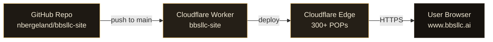

# bbsllc-site

Static marketing site for **BBS LLC, Bergeland Business Services**, a boutique data consultancy specializing in location intelligence, gravity models, geospatial analytics, and forensic data work based in Maple Grove, MN.

- **Live:** https://www.bbsllc.ai
- **Repo:** https://github.com/nbergeland/bbsllc-site
- **Stack:** Single-file vanilla HTML/CSS, no build step, no JS framework
- **Hosting:** Cloudflare Workers (edge, global)

## Architecture



A push to `main` triggers a Cloudflare Worker deployment. The Worker serves `index.html` (and `robots.txt`) from the edge, so first-byte latency is dominated by the closest Cloudflare POP, not by an origin server.

## Tech Stack

| Layer       | Choice                                                                 |
|-------------|------------------------------------------------------------------------|
| Markup      | Hand-written HTML5, single `index.html`                                |
| Styling     | Vanilla CSS with custom properties (no Tailwind, no preprocessor)      |
| Typography  | Google Fonts: **Fraunces** (display serif), **Instrument Sans** (UI sans), JetBrains Mono (mono accents) |
| JavaScript  | None. One ~10-line inline `IntersectionObserver` reveal, no framework  |
| Icons       | Inline SVG (custom mark)                                               |
| Hosting     | Cloudflare Workers, custom domain, automatic HTTPS                     |

Design tokens (palette, type scale, spacing) live in `:root` CSS variables in `index.html`.

## Site Sections

| #   | Section          | Purpose                                                                                  |
|-----|------------------|------------------------------------------------------------------------------------------|
| 00  | **Hero**         | Display lede ("Turning complexity into clarity through data"), specialties, stack, ticker |
| 01  | **Capabilities** | Four practice cards: Location Intelligence, Geospatial Modeling, Forensic Data, Data Product Engineering |
| 02  | **Engagement Log** | Selected work table: Brick Inc., Dakota Worldwide (Locus Pro), independent site selection, Target network overlap, forensic accounting |
| 03  | **Credentials**  | Principal bio (Nick Bergeland), quote, education, base, languages, engagement model       |
| 04  | **CTA**          | "Let's build the thing that answers your question." Calendly + email                      |
| 05  | **Footer**       | Brand mark, navigation, contact, social, copyright                                       |

A scrolling marquee ("ticker") sits between Hero and Capabilities and surfaces the practice areas in motion.

## Deployment Workflow

1. Edit `index.html` locally.
2. Commit and push to `main`.
3. Cloudflare Workers picks up the change via the GitHub integration and rolls it out to the edge.
4. Verify at https://www.bbsllc.ai (cache TTL is short on HTML; assets are immutable).

There is no build, no bundler, no CI pipeline beyond Cloudflare's deploy. To roll back, revert the commit and push.

## Domain Configuration

- **Primary (canonical):** `www.bbsllc.ai`
  - Bound to the Worker via Cloudflare custom domain
  - Apex `bbsllc.ai` redirects to `www.bbsllc.ai` (301)
- **Future:** `bbsolutions.biz`
  - Will 301 redirect to `https://www.bbsllc.ai` once DNS is migrated
  - Implemented as a Cloudflare Bulk Redirect (no Worker code change needed)

DNS records live in Cloudflare. SSL is full (strict), HSTS enabled.

## Performance Notes

- **GPU-accelerated ticker.** The marquee uses `transform: translate3d()` with `will-change: transform`, `backface-visibility: hidden`, and `perspective: 1000px` so the animation runs on the compositor thread instead of the main thread. `pointer-events: none` and `contain: content` keep it from intercepting touch scroll or invalidating layout in surrounding sections.
- **Reduced motion respected.** `@media (prefers-reduced-motion: reduce)` disables the ticker animation and smooth scroll.
- **Mobile scroll.** Smooth scroll is disabled below 768px (momentum scrolling handles it natively). The ticker speeds up on narrow viewports so density-per-second matches desktop feel.
- **Zero render-blocking JS.** The single `<script>` tag runs after parse and only attaches a reveal observer.
- **Font preconnects** to `fonts.googleapis.com` and `fonts.gstatic.com` shave the TLS handshake from the critical path.

### Responsive breakpoints

| Breakpoint | Triggers                                                                 |
|------------|--------------------------------------------------------------------------|
| `880px`    | Section heads collapse to single column, work rows stack, principal grid stacks, footer reflows to 2-up |
| `768px`    | Smooth scroll disabled, ticker speed bumped to 5s loop                   |
| `560px`    | Hero meta stacks vertically, approach grid drops to 1 column             |
| `480px`    | Buttons shrink, CTA row goes vertical, footer goes single column         |
| `420px`    | Credentials grid collapses to a single column                            |

## Local Development

No tooling required.

```bash
# Option 1: open the file directly
open index.html

# Option 2: any static server (recommended for accurate font loading)
python3 -m http.server 8080
# → http://localhost:8080
```

Edit `index.html` and refresh. There is nothing to compile.

## Repository Structure

```
.
├── index.html      # entire site (markup, styles, reveal script)
├── robots.txt      # crawler policy
└── README.md       # this file
```

## License & Copyright

© 2023–2025 BBS LLC, Bergeland Business Services. All rights reserved.

Source code for the site is published in this repo for transparency. The BBS LLC name, mark, and content are not licensed for reuse.
